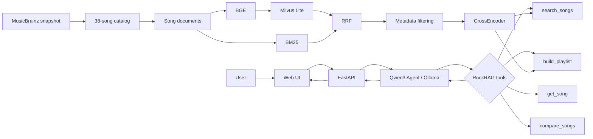

# RockRAG

An LLM-powered hard rock and metal discovery system combining hybrid retrieval,
CrossEncoder reranking, grounded generation, and a native tool-calling agent.

RockRAG follows one rule: **retrieve first, generate second**. Song facts come
from a small, auditable catalog rather than the language model's memory.

## Demo

The responsive Web app has two modes: **Agent** runs the Qwen tool-calling loop
and exposes an auditable tool trace; **Search** directly shows Hybrid +
CrossEncoder results. Song cards display catalog metadata and clearly labeled
reranker scores. No external artwork is fetched.

## Architecture



Ollama's native `tool_calls` select the four catalog-only tools. There is no
regex routing or prompt-parsed fake tool calling. Runs retain tool names,
arguments, outputs, steps, and latency—but never hidden chain-of-thought.

## Retrieval evaluation

Actual warmed-up results on the **38-song catalog** and **15-query manually
curated benchmark** are below. Graded qrels (`2=highly relevant`, `1=relevant`)
come from catalog metadata and curator taxonomy, not model-generated labels.

| Retrieval system | Recall@5 | Recall@10 | MRR@10 | nDCG@5 | nDCG@10 | P@5 | Mean latency |
|---|---:|---:|---:|---:|---:|---:|---:|
| Dense | 0.6179 | 0.7701 | 0.8667 | 0.6872 | 0.7246 | 0.4400 | 0.013496 s |
| Hybrid | 0.7318 | 0.9373 | 0.9667 | 0.8729 | 0.9096 | 0.5867 | 0.016298 s |
| Hybrid + CrossEncoder | 0.8051 | 0.9373 | 1.0000 | 0.9756 | 0.9698 | 0.6667 | 0.029854 s |

The 11.027410-second reranker cold load is excluded from steady-state latency.
Per-query results are in `evaluation/results/latest.json`. Recall measures
coverage, MRR rewards an early first relevant result, and nDCG includes graded
relevance and rank position.

## Quick start

Requirements: Ubuntu/WSL2, Python 3.11 or 3.12, and Ollama.

```bash
python3 -m venv .venv
source .venv/bin/activate
python -m pip install -r requirements.txt
cp .env.example .env
ollama pull qwen3:4b-instruct
ollama serve
```

In another terminal:

```bash
source .venv/bin/activate
python scripts/build_index.py
python scripts/run_web.py
```

Open <http://localhost:8000>; API docs are at <http://localhost:8000/docs>.
The equivalent direct command is:

```bash
PYTHONPATH=src uvicorn rockrag.api:app --host 0.0.0.0 --port 8000
```

The page loads when Ollama is offline. Search remains available, while Agent
requests return a clear `503` local-LLM error.

## Configuration

```dotenv
LLM_PROVIDER=ollama
OLLAMA_MODEL=qwen3:4b-instruct
OLLAMA_HOST=http://localhost:11434
WEB_HOST=0.0.0.0
WEB_PORT=8000
```

Gemini remains optional. Never commit `.env` or API keys.

## Docker

The image contains the Python application and catalog, but not Qwen, model
caches, `.env`, or the Milvus database. Compose uses host Ollama and persists
artifacts in `./storage`.

```bash
OLLAMA_HOST=0.0.0.0:11434 ollama serve
docker compose up --build
```

Compose maps `host.docker.internal` to the Linux/WSL host gateway. If the mounted
storage is empty, the entrypoint runs the existing `scripts/build_index.py` once;
subsequent starts reuse `storage/rockrag.db`. First startup can be slow while BGE
files download into the mounted cache.

## API

| Method | Endpoint | Purpose |
|---|---|---|
| `GET` | `/health` | Catalog/model status and lightweight Ollama reachability |
| `POST` | `/api/agent` | Existing auditable RockRAG agent |
| `POST` | `/api/search` | Hybrid retrieval + CrossEncoder reranking |
| `GET` | `/api/song/{song_id}` | Exact factual lookup |
| `POST` | `/api/compare` | Metadata comparison for 2–5 songs |

All bodies use explicit Pydantic models and appear in `/docs`.

## Tests

```bash
source .venv/bin/activate
python -m unittest discover -s tests -v
```

Normal Agent/API tests use fake clients and never call Qwen. Existing integration
coverage validates Milvus and the cached CrossEncoder. The Phase 8 run discovered
60 tests: 57 passed by default and 3 opt-in integrations were skipped; those 3
integration tests also passed when explicitly enabled.

## Repository structure

```text
data/          MusicBrainz snapshot and normalized catalog
evaluation/    Curated qrels, metrics, runner, saved results
src/rockrag/   Models, retrieval, reranking, agent, API
scripts/       Index, inspection, CLI and Web launchers
tests/         Phase 1–8 tests
web/           Framework-free HTML, CSS and safe DOM JavaScript
storage/       Ignored Milvus DB and model cache
```

## Data provenance and grounding

Recording metadata comes from a rate-limited MusicBrainz snapshot. Curator tags
retain explicit provenance and missing facts are not inferred. Structured
generation validates IDs and backfills factual fields from retrieved records.

## Limitations

- The 38-song catalog cannot provide broad coverage.
- The 15-query manually curated benchmark is too small for general claims.
- Reason-level faithfulness is constrained but not automatically guaranteed.
- The MS MARCO reranker is not trained specifically for music.
- Local LLM and embedding cold starts are hardware-dependent.
- There are no accounts, history database, streaming, or authentication.

## Future work

- Expand and version the verified catalog and evaluation set.
- Train or select a music-domain reranker.
- Add automatic reason-faithfulness validation and response streaming.
- Add reproducible cloud deployment and optional music-service integrations.
